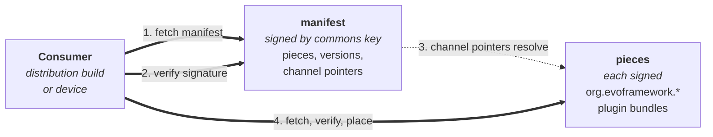

# evo-device-audio-artefacts

> The release plane for [evo-device-audio](https://github.com/foonerd/evo-device-audio). Brand-neutral audio plugin commons artefacts, signed by the evo project, fetched by any audio distribution.

Manifest in. Signed bytes out. Consumers pick the channel.

This repository is the device-facing (and distribution-facing) surface of the audio-domain plugin commons. Editing source code in [evo-device-audio](https://github.com/foonerd/evo-device-audio) does not touch these assets. What lands here is exactly what an audio distribution (or a device tracking commons directly) fetches and verifies.

## What lives here



Two stores. Do not mix them.

**Git (this tree)** — piece slots that stay under GitHub's 100 MB blob limit:

- `binaries/evo-device-audio/<version>/<target>/` — audio steward
- `bundles/<plugin>/<target>/<plugin>-<version>-<target>.tar.gz` — OOP plugins
- `channels/` — `dev` / `test` / `prod` pointer files
- `bundles/distribution/<version>.toml` — thin pointer at the first-boot tarball (URL, sha256, size). Not the tarball.

**GitHub Releases** — the first-boot installer tarball (~110 MB). GitHub rejects git blobs over 100 MB. Testers already curl Latest:

```
https://github.com/foonerd/evo-device-audio-artefacts/releases/latest/download/evo-device-audio-<triple>-<version>.tar.gz
```

A named cut is `releases/download/<tag>/`. Re-upload of the same release tag is a refuse.

`pieces/` is leftover stub catalogue (`manifest.toml` + `source.toml` only) from a deleted workflow. Promote ignores it. Real plugin bytes are under `bundles/`.

## Channels

Three named tracks of release readiness: `dev`, `test`, `prod`. Same shape as every other release plane in the evo ecosystem.

-   **A channel is a pointer, not a bucket.** A version of a piece is built once, signed once, stored once. Promotion from `dev` to `test` is a manifest edit - the channel's pointer now names that version. The bytes do not change; the signature does not change. Bit-identical artefacts across every channel they appear on.
-   **Selection is per-piece, per-consumer.** A consumer's channel map says, for each piece: which channel's pointer do you track? A developer iterating on one plugin can track `dev` for that plugin and `prod` for everything else.
-   **Rollback is a pointer move.** Re-promote a prior version to the same channel. No rebuild. No re-signing.

## Consuming artefacts

Two consumer profiles:

-   **Audio distributions** (`evo-device-<vendor>` repositories) bundle the commons trust root by default and admit `org.evoframework.*` plugins via their catalogue. The distribution's build process or its own release plane references commons pieces by version and channel.
-   **Devices** that bundle the commons trust root may fetch commons pieces directly from this repository at runtime, alongside the vendor's own pieces, when the device-side fetch tooling is wired to pull from multiple release planes.

Either way: the consumer verifies the manifest signature against the commons public key (`keys/commons-plugin-signing-public.pem` in the source repo), then verifies each piece's signature before placing it.

## Publishing artefacts

Workflows on [evo-device-audio](https://github.com/foonerd/evo-device-audio) write here:

-   **publish-pieces** — mint steward and plugin slots into `binaries/` and `bundles/`. Append-only. A published version is frozen.
-   **publish-distribution-bundle** — bake the first-boot tarball, upload it as a GitHub Release asset, commit only `bundles/distribution/<version>.toml`. Do not `git add` the tarball.
-   **promote** — move a channel pointer. No rebuild.

Sibling public repos (`evo-ui`, `evo-kiosk`, `evo-device-boot`) mint their own pieces into this same repository. One fetch plane.

## Signing and trust

The evo project signs every artefact under this namespace with the commons signing key. The private key lives only in the GitHub Actions repository secret `PLUGIN_SIGNING_KEY_PEM` on the source repository. The public half is committed in the source repository at [`keys/commons-plugin-signing-public.pem`](https://github.com/foonerd/evo-device-audio/blob/main/keys/commons-plugin-signing-public.pem) with sidecar metadata at [`keys/commons-plugin-signing-public.meta.toml`](https://github.com/foonerd/evo-device-audio/blob/main/keys/commons-plugin-signing-public.meta.toml).

Public key fingerprint (SHA256 of the DER-encoded SubjectPublicKeyInfo):
`9cd7d7381ee7c2b3bfa490b39077afdc925192299dda661ef94dddba71e574da`

Distributions that admit `org.evoframework.*` plugins bundle this trust root by default. Operators retain final say per the framework's operator-sovereignty position.

## Status

Piece slots and channel files live in this git tree. The installer tarball lives on GitHub Releases. See [RELEASE_PLANE.md](https://github.com/foonerd/evo-core/blob/main/docs/engineering/RELEASE_PLANE.md) §2.4–§2.5.

## Related

-   [foonerd/evo-device-audio](https://github.com/foonerd/evo-device-audio) - the source repository this release plane serves.
-   [foonerd/evo-core](https://github.com/foonerd/evo-core) - the framework.

## License

Apache 2.0. See [LICENSE](LICENSE).
